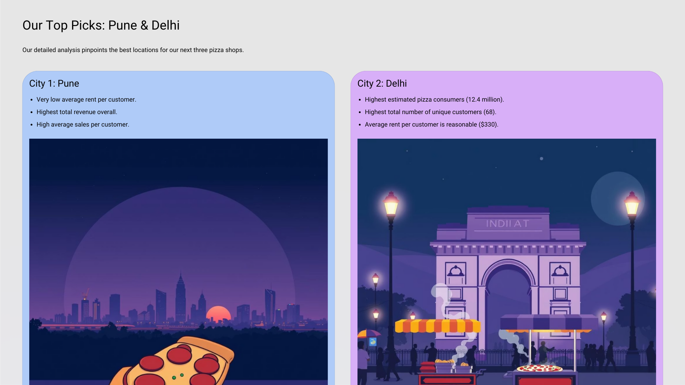
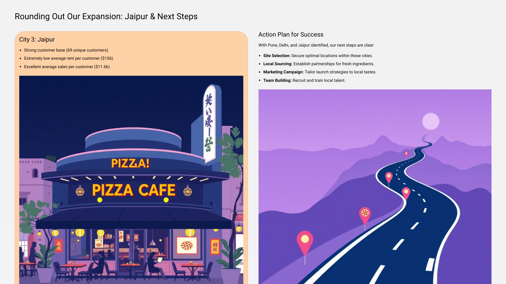

# Ovenly Pizza Expansion SQL Project

## Objective
The goal of this project is to analyze the sales data of Ovenly Pizza, a company that has been selling its products online since January 2023, and to recommend the top three major cities in India for opening new Pizza shop locations based on consumer demand and sales performance.

## Key Questions
1. **Pizza Consumers Count**  
   How many people in each city are estimated to consume Pizza, given that 40% of the population does?

2. **Total Revenue from Pizza Sales**  
   What is the total revenue generated from Pizza sales across all cities in the last quarter of 2023?

3. **Sales Count for Each Product**  
   How many units of each Pizza product have been sold?

4. **Average Sales Amount per City**  
   What is the average sales amount per customer in each city?

5. **City Population and Pizza Consumers**  
   Provide a list of cities along with their populations and estimated Pizza consumers.

6. **Top Selling Products by City**  
   What are the top 3 selling products in each city based on sales volume?

7. **Customer Segmentation by City**  
   How many unique customers are there in each city who have purchased Pizza products?

8. **Average Sale vs Rent**  
   Find each city and their average sale per customer and avg rent per customer

9. **Monthly Sales Growth**  
   Sales growth rate: Calculate the percentage growth (or decline) in sales over different time periods (monthly).

10. **Market Potential Analysis**  
    Identify top 3 city based on highest sales, return city name, total sale, total rent, total customers, estimated Pizza consumer
    

## Recommendations
After analyzing the data, the recommended top three cities for new store openings are:

**City 1: Pune**  
1. Average rent per customer is very low.  
2. Highest total revenue.  
3. Average sales per customer is also high.

**City 2: Delhi**  
1. Highest estimated Pizza consumers at 12.4 million.  
2. Highest total number of customers, which is 68.  
3. Average rent per customer is 330 (still under 500).

**City 3: Jaipur**  
1. Highest number of customers, which is 69.  
2. Average rent per customer is very low at 156.  
3. Average sales per customer is better at 11.6k.

### Top Picks: Pune & Delhi

### Jaipur & Next Steps

---

